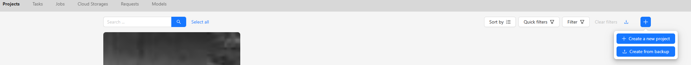
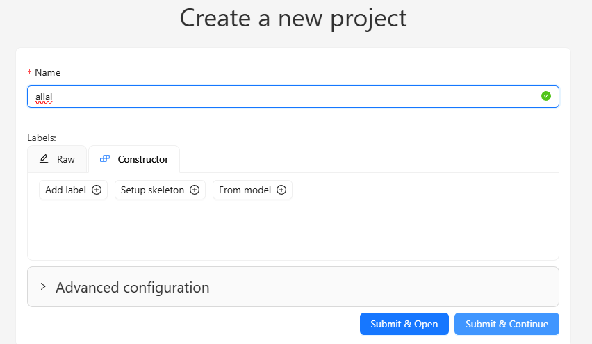
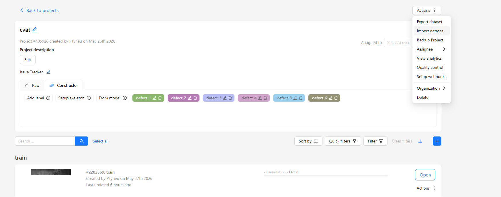
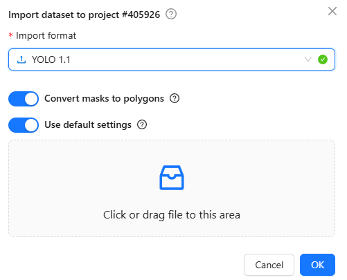
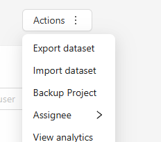
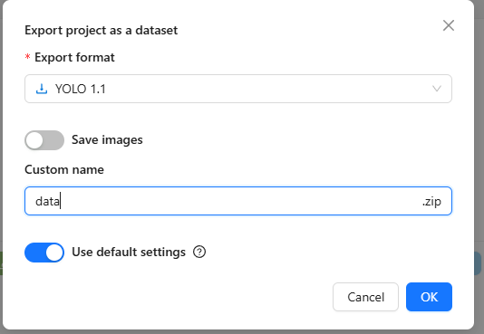
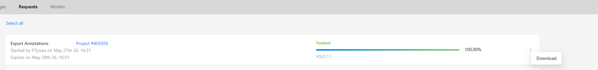

# Детекция дефектов на металлопрокате

## О проекте

Вы — CV-инженер на металлургическом предприятии. Задача — построить модель детекции дефектов на поверхности стального проката по изображениям с камер производственной линии.

В основе лежит публичный датасет [Severstal Steel Defect Detection](https://www.kaggle.com/competitions/severstal-steel-defect-detection), однако он был видоизменен для приближения к реальным производственным условиям. Данные могут содержать шум в разметке — это часть задания.

---

## Что дано

```
train_bboxes.csv       — аннотации с разбиением на train/val
train_images/          — изображения 1600×256 px
student_base.ipynb     — шаблон проекта с готовыми функциями
```

**`train_bboxes.csv`** — CSV-файл, в котором каждая строка описывает один дефект:

| Колонка   | Описание                          |
|-----------|-----------------------------------|
| ImageId   | Имя файла изображения             |
| ClassId   | Класс дефекта                     |
| x_min     | Левая граница bbox (пиксели)      |
| y_min     | Верхняя граница bbox (пиксели)    |
| x_max     | Правая граница bbox (пиксели)     |
| y_max     | Нижняя граница bbox (пиксели)     |
| split     | Сплит: `train` или `val`          |

**`student_base.ipynb`** — шаблон проекта, в котором уже реализованы:

- `convert_to_yolo(df, image_dir, output_dir)` — конвертация DataFrame в YOLO-формат с автоматическим созданием `data.yaml`
- `evaluate_model(model_path, data_yaml)` — валидация модели (mAP@0.5) и замер FPS
- `export_for_cvat(yolo_dir, split)` — экспорт аннотаций в ZIP для просмотра/редактирования в CVAT
- `import_from_cvat(zip_path, df)` — импорт исправленных аннотаций из CVAT обратно в DataFrame

Шаблон содержит пошаговую структуру проекта с местами для вашего кода.

---

## Что нужно сделать

### 1. EDA и очистка данных

Проведите разведочный анализ данных **до** обучения модели:

- Изучите распределение классов, размеры и пропорции bbox.
- Визуализируйте аннотации на изображениях.
- Определите, все ли классы действительно различны. Возможно, некоторые из них стоит объединить.
- Проверьте, нет ли аномальных аннотаций (слишком маленькие/большие bbox, пустые области).
- Опишите и обоснуйте все решения по очистке данных.
- **Требование заказчика:** итоговое количество классов — **не менее 4**.

### 2. Обучение модели

- Выберите архитектуру детекции (YOLO, Faster R-CNN, RT-DETR или другую).
- Обучите модель. При необходимости используйте аугментации.
- Подберите гиперпараметры.

### 3. Оценка качества

- **Основная метрика — mAP@0.5** на валидационной выборке. Цель — добиться максимального значения.
- Проведите error analysis: на каких классах модель ошибается, какие типы ошибок преобладают.
- Приведите графики precision-recall (для модели YOLO они будут содержаться внутри папки эксперимента).

### 4. Скорость инференса

- **Минимальное требование — 60 FPS** на GPU (batch size = 1, без учёта I/O).
- Замер FPS уже реализован в `student_base.ipynb` — функция `evaluate_model`. ВАЖНО - расчет фпс и mAP реализованы под модель YOLO, если вы обучаете другую модель, нужно скорректировать предварительно функцию `evaluate_model(model_path, data_yaml)` под подходящий для вашей модели формат.
- Если модель не укладывается — примените оптимизации: экспорт в ONNX/TensorRT, уменьшение входного разрешения, выбор более лёгкой архитектуры. Пример конвертации модели YOLO в другие форматы — [тут](https://docs.ultralytics.com/modes/export).

### 5. Синтетические данные (опционально)

Если в ходе EDA вы обнаружите, что некоторые классы дефектов представлены значительно хуже остальных, можно сгенерировать синтетические данные:

- Выберите один или несколько классов с наименьшим числом примеров.
- Сгенерируйте синтетические изображения любым способом: copy-paste аугментация, CutMix, Stable Diffusion, стилизация фона.
- Обучите модель с добавлением синтетики и сравните mAP до и после.
- Опишите подход и результаты.

### 6. Работа с CVAT (опционально)

В ноутбуке реализована возможность выгрузить интересующий сплит в [CVAT](https://www.cvat.ai/) для визуальной корректировки аннотаций.

#### Экспорт в CVAT

Функция `export_for_cvat` создаст ZIP-архив с изображениями и аннотациями в формате YOLO 1.1.

1. Создайте новый проект, нажав **Create new project**:

   

2. Назовите проект и нажмите **Submit & Continue**:

   
   

3. Во вкладке **Actions** выберите **Import dataset**. В открывшемся окне укажите формат **YOLO 1.1** и перетащите сгенерированный ZIP-файл в указанную область:

   

   Дождитесь завершения импорта.

#### Импорт обратно из CVAT

1. После корректировки аннотаций во вкладке **Actions** выберите **Export dataset**:

   
   

   Укажите формат **YOLO 1.1** и задайте название.

2. Перейдите во вкладку **Requests**, нажмите на три точки справа и выберите **Download**:

   

3. Подтяните скачанный архив в рабочую среду и обновите данные функцией `import_from_cvat`. Таким образом можно, в том числе, преобразовать разметку из формата YOLO в формат для других архитектур (например, Faster R-CNN) выгрузив данные из сивата в уже подходящшем виде для обучения и распаковав архив.

---

## Рекомендации

- Начните с baseline на данных как есть — это даст ориентир по метрикам.
- FPS замеряйте после прогрева модели (первые кадры не учитываются — это делает `evaluate_model` автоматически).
- Фотографии из валидационной выборки удалять нельзя дабы соблюдать справедливость эксперимента (при необходимости добавлять можно).
- Ваша цель - добиться максимального mAP удовлетворяя условия по FPS.
- Если хотите обучить модель, архитектуры не YOLO, выгрузите датасет (частями для сохранения целостности) в CVAT и выгрузите в подходящем для вашей модели формате, распакуйте архивы и скорректируйте функцию `evaluate_model` под формат, подходящий вашей модели.

